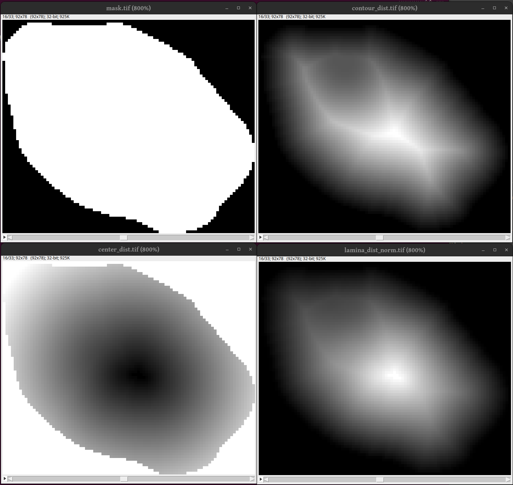

.. _ch_details:

Details
=======

All RadIAnTkit tools are accessible from the terminal using the
``radiantkit`` entry point.

.. code:: none

   usage: radiantkit [-h] [--version] sub_command ...

Run ``radiantkit -h`` to access the help page directly in the terminal.

nd2_to_tiff
-----------

Use ``radiantkit nd2_to_tiff`` to convert one or more nd2 files into single
channel tiff images. You can specify multiple nd2 files, or multiple
folders containing nd2 files, by separating them with a space. When a
folder is specified as input, all files matching the “inreg” regular
expression are converted. You can change the regular expression to
convert a specific files subset.

In the case of 3+D images, the script also checks for consistent deltaZ
distance across consecutive 2D slices (i.e., dZ). If the distance is
consitent, it is used to set the tiff image dZ metadata. Otherwise, the
script tries to guess the correct dZ and reports it in the log. If the
reported dZ is wrong, please enforce the correct one using the -Z
option. If a correct dZ cannot be automatically guessed, the field of
view is skipped and a warning is issued to the user. Use the –fields and
-Z options to convert the skipped field(s).

File naming
~~~~~~~~~~~

The output tiff file names follow the specified template (-T). A
template is a string including a series of “seeds” that are replaced by
the corresponding values when writing the output file. Available seeds
are: - ``${channel_name}`` : channel name, lower-cased. -
``${channel_id}`` : channel ID (number). - ``${series_id}`` : series ID
(number). - ``${dimensions}`` : number of dimensions, followed by “D”. -
``${axes_order}`` : axes order (e.g., “TZYX”).

Leading 0s are added up to 3 digits to any ID seed.

The default template is ``${channel_name}_${series_id}``. Hence, when
writing the 3rd series of the “a488” channel, the output file name would
be: “a488_003.tiff”.

.. literalinclude:: help_nd2_to_tiff.txt
   :language: none

Alternatives
~~~~~~~~~~~~

Most likely the software on your microscope can export tiff files
directly. If you use that, make sure that there is only one channel
per image (and no time series). A general solution is to use `FIJI`_
which is available for all major platforms. For linux there is also
`nd2tool`_ which should be both faster and use less memory than the
conversion in radiantkit.

.. _FIJI: https://fiji.sc/
.. _nd2tool: https://www.github.com/elgw/nd2tool/

tiff_findoof
------------

This module detects and discards images where the nuclei are not
centered along the axial dimension (z). Just include it in your
pipeline and the report will be free from those images.

Calculates the gradient magnitude :math:`F_{GM}(z)` for each plane:

.. math::

   F_{GM}(z) = \sum_x \sum_y \left( \frac{\partial I(x,y,z)}{dx}^2 \frac{\partial I(x,y,z)}{dx}^2 \right)^{1/2}

of, if ``--intensity-sum`` is specified,

.. math::

   F_{S}(z) = \sum_x \sum_y I(x,y,z)

For non-deconvolved images :math:`F_{GM}` is a proxy for the most
in-focus plane, or rather the centre of the nuclei. For deconvolved
images :math:`F_{S}` points out the plane where the nuclei are largest.

The *most-in-focus slice* :math:`z_f` is then calculated as

.. math::

   z_f = \mbox{arg max } F(z)

If :math:`z_f` is not in middle of the stack, the image is considered
out-of-focus. The middle of the stack is the 50% of the slices closest
to the middle z-plane, or a larger/smaller proportion when ``--fraction
f`` is specified.

If you are curious about the results, the file `oof.tsv` will be
created, which looks like this:

.. code::

   $ cat oof.tsv
   Z-slice index	Gradient of magnitude	path	response
   1	21.74676823724797	dapi_002.tif	out-of-focus
   2	21.872963326063726	dapi_002.tif	out-of-focus
   3	22.082429165368556	dapi_002.tif	out-of-focus
   4	22.352404219416595	dapi_002.tif	out-of-focus
   ...

i.e. for each image and slice it will tell the value of the feature
that was calculated.

.. literalinclude:: help_tiff_findoof.txt
   :language: none

tiff_segment
------------

The `tiff_segment` module will segment the nuclei stained in DAPI or
similar DNA stain.

.. literalinclude:: help_tiff_segment.txt
   :language: none

Alternatives/bypass
~~~~~~~~~~~~~~~~~~~

If you are not happy with the segmentation results you can use any
other program to perform the segmentation. Just make sure to follow
the file naming conventions and the later stages of the pipeline will
be able to use your custom segmentation masks.

One option to consider is `ilastic`_.

.. _ilastic: https://www.ilastik.org/

radial_population
-----------------

This part looks in all nuclei ("particles") and measures the pixel
values and distance to lamina at each pixel in the mask.

In the following image we see to to the top right a cross section of a
nuclei mask at plane 16. In the top right we see a cross section of
the Euclidean distance transform from the outside and in. As can be
seen the distance field has much structure too it. Bottom left: The
distance from the center (using the default center definition) which
is much smoother. Buttom right: The final distance field which is used
in radiantkit.

Below follow the complete options for the `radial_population` module.

.. attention::

   It is recommended that ``--slice2d`` is used in most cases.

.. versionadded:: 0.1.1 ``--slice2d``

.. literalinclude:: help_radial_population.txt
   :language: none

report
------

This module is run as the last step to generate a report based on the
data available from the previous steps.

.. literalinclude:: help_report.txt
   :language: none
